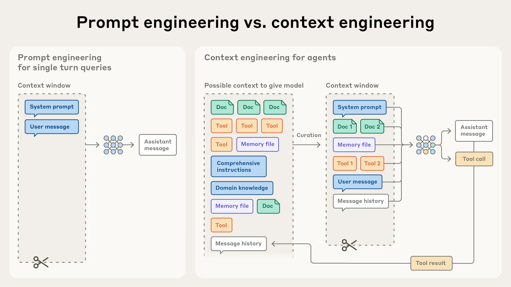

# AI智能体的有效上下文工程

**发布于2025年9月29日**

上下文是AI智能体的关键但有限的资源。本文探讨如何有效管理和策划驱动智能体的上下文。

经过几年对提示工程的关注后，一个新术语开始凸显：**上下文工程**。使用语言模型的重点正从寻找合适的提示词和短语，转向回答更广泛的问题："什么样的上下文配置最有可能产生模型的期望行为？"

上下文是指从大语言模型(LLM)采样时包含的全部token。工程问题在于：在LLM固有约束下，优化这些token的效用以持续达成期望结果。有效驾驭LLM通常需要**从上下文角度思考**——即考虑LLM在任何时刻可用的整体状态及该状态可能产生的行为。

本文将探讨上下文工程这门新兴艺术，并提供构建可控、有效智能体的精细化思维模型。

## 上下文工程 vs. 提示工程

在Anthropic，我们视上下文工程为提示工程的自然演进。**提示工程**指编写和组织LLM指令以获得最佳结果的方法。**上下文工程**则指在LLM推理期间策划和维护最优token集（信息）的策略，包括提示之外的所有其他信息。

早期，提示是AI工程工作的最大组成部分，因为多数用例需要针对单次分类或文本生成任务优化的提示。然而，随着我们转向构建可多轮推理、长时程运行的智能体，我们需要管理整个上下文状态的策略（系统指令、工具、MCP、外部数据、消息历史等）。

循环运行的智能体会生成越来越多可能与下一轮推理相关的数据，这些信息必须循环精炼。上下文工程就是从不断演变的可能信息中，策划什么将进入有限上下文窗口的艺术和科学。

**[图：提示工程 vs. 上下文工程对比图]**

与编写提示的离散任务不同，上下文工程是迭代的，每次决定传递给模型什么内容时都会进行策划。

## 为什么上下文工程对构建强大智能体至关重要

尽管LLM速度快且能处理越来越大的数据量，但我们观察到它们像人类一样，在某个点会失去焦点或感到困惑。"大海捞针"式基准测试研究发现了**上下文衰减**现象：随着上下文窗口中token数量增加，模型从该上下文准确回忆信息的能力下降。

虽然不同模型的降级程度不同，但这一特征在所有模型中都会出现。因此，**上下文必须被视为边际收益递减的有限资源**。像人类工作记忆容量有限一样，LLM有"注意力预算"，解析大量上下文时会消耗这一预算。每引入一个新token都会在一定程度上消耗预算，增加了仔细策划LLM可用token的必要性。

这种注意力稀缺源于LLM的架构约束。LLM基于Transformer架构，使每个token能够关注整个上下文中的其他所有token，产生n个token的n²对配对关系。

随着上下文长度增加，模型捕捉这些配对关系的能力被拉伸变薄，在上下文大小和注意力聚焦之间产生自然张力。此外，模型从训练数据分布中形成注意力模式，其中短序列通常比长序列更常见。这些现实意味着**深思熟虑的上下文工程对构建强大智能体至关重要**。

## 有效上下文的构成

鉴于LLM受限于有限的注意力预算，良好的上下文工程意味着找到**最小的高信号token集**，最大化某种期望结果的可能性。

### 系统提示

应极其清晰，使用简单直接的语言，在适当的高度呈现想法。**适当高度**是两种常见失败模式之间的黄金地带：一个极端是硬编码复杂、脆弱的逻辑；另一极端是提供模糊的高级指导。最优高度在两者之间取得平衡：既足够具体以有效指导行为，又足够灵活以提供强启发式引导。

**[图：系统提示校准图]**
一端是脆弱的硬编码提示，另一端是过于笼统或错误假设共享上下文的提示。

我们建议将提示组织成不同部分（如`<background_information>`、`<instructions>`、`## Tool guidance`等），使用XML标签或Markdown标题划分这些部分。

无论如何构建系统提示，都应追求**充分概述期望行为的最小信息集**。（注意：最小不等于简短；仍需预先提供足够信息）。最好从用最佳模型测试最小提示开始，然后根据初始测试中发现的失败模式添加清晰的指令和示例。

### 工具

允许智能体与环境交互并在工作时引入新的额外上下文。因为工具定义了智能体与其信息/行动空间的契约，工具促进效率极其重要——既要返回token高效的信息，又要鼓励高效的智能体行为。

工具应该自包含、对错误健壮、用途极其清晰。输入参数应描述性强、无歧义，并发挥模型的固有优势。

最常见的失败模式之一是**臃肿的工具集**——覆盖过多功能或导致使用哪个工具的决策点模糊。如果人类工程师无法明确说出某情况下应使用哪个工具，就不能指望AI智能体做得更好。

### 示例

提供示例（few-shot提示）是我们持续强烈建议的最佳实践。然而，团队常常将一长串边缘案例塞进提示，试图阐明LLM应遵循的每条规则。**我们不推荐这样做**。相反，我们建议策划一组多样化的典型示例，有效展示智能体的期望行为。对LLM而言，示例是"一图胜千言"。

我们对上下文各组件（系统提示、工具、示例、消息历史等）的总体指导是：**保持上下文信息丰富但紧凑**。

## 上下文检索和智能体搜索

在《构建有效AI智能体》中，我们强调了基于LLM的工作流和智能体的区别。此后，我们倾向于一个简单的智能体定义：**在循环中自主使用工具的LLM**。

我们看到该领域正在向这一简单范式收敛。随着底层模型能力增强，智能体的自主水平可以扩展：更智能的模型让智能体能够独立导航复杂问题空间并从错误中恢复。

我们现在看到工程师如何为智能体设计上下文的思维转变。今天，许多AI原生应用采用某种基于嵌入的推理前检索来为智能体提供重要上下文。随着向更智能化方法转变，我们越来越多地看到团队用**"即时"上下文策略**增强这些检索系统。

智能体不是预先处理所有相关数据，而是维护轻量级标识符（文件路径、存储查询、网络链接等），使用工具在运行时动态加载数据到上下文中。Anthropic的智能编码解决方案Claude Code使用这种方法对大型数据库执行复杂数据分析。模型可以编写目标查询、存储结果，并利用Bash命令如head和tail分析大量数据，而无需将完整数据对象加载到上下文中。这种方法类似人类认知：我们通常不会记忆整个信息语料库，而是引入文件系统、收件箱和书签等外部组织和索引系统，按需检索相关信息。

除存储效率外，这些引用的元数据提供了高效精炼行为的机制。对在文件系统中运行的智能体，tests文件夹中的test_utils.py文件与src/core_logic/中同名文件暗示了不同的目的。文件夹层次、命名约定和时间戳都提供重要信号。

让智能体自主导航和检索数据还能实现**渐进式披露**——让智能体通过探索逐步发现相关上下文。每次交互产生的上下文为下一个决策提供信息：文件大小暗示复杂性；命名约定提示目的；时间戳可能代表相关性。智能体可以逐层组装理解，在工作记忆中只保留必要内容。这种自我管理的上下文窗口使智能体专注于相关子集，而不是淹没在详尽但可能不相关的信息中。

当然，这有权衡：运行时探索比检索预计算数据慢。不仅如此，还需要有主见、深思熟虑的工程来确保LLM拥有有效导航信息环境的正确工具和启发式方法。

在某些情况下，最有效的智能体可能采用**混合策略**——预先检索部分数据以提高速度，并根据其判断进行进一步自主探索。"正确"自主水平的决策边界取决于任务。Claude Code就是采用混合模型的智能体：CLAUDE.md文件预先放入上下文，而glob和grep等原语允许它导航环境并即时检索文件。

随着模型能力提升，智能体设计将趋向于让智能模型智能地行动，人工策划逐渐减少。鉴于该领域的快速进展，"做最简单有效的事"可能仍是我们对在Claude基础上构建智能体的团队的最佳建议。

## 长时程任务的上下文工程

长时程任务要求智能体在token数超过LLM上下文窗口的行动序列中保持连贯性、上下文和目标导向行为。对于持续数十分钟到数小时的任务，如大型代码库迁移或综合研究项目，智能体需要专门技术来应对上下文窗口大小限制。

等待更大的上下文窗口似乎是显而易见的策略。但在可预见的未来，所有大小的上下文窗口都可能受到上下文污染和信息相关性问题的影响——至少在需要最强智能体性能的情况下。为使智能体能够有效跨越延长的时间范围工作，我们开发了几种直接解决这些上下文污染约束的技术：**压缩、结构化笔记和多智能体架构**。

### 压缩

压缩是指当对话接近上下文窗口极限时，总结其内容，并用摘要重新启动新的上下文窗口。压缩通常是上下文工程中推动更好长期连贯性的第一个杠杆。其核心是高保真地提炼上下文窗口的内容，使智能体能够以最小性能降级继续。

例如在Claude Code中，我们通过将消息历史传递给模型来总结和压缩最关键的细节来实现这一点。模型保留架构决策、未解决的bug和实现细节，同时丢弃冗余的工具输出或消息。然后智能体可以用这个压缩上下文加上最近访问的五个文件继续。

压缩的艺术在于选择保留什么与丢弃什么，因为过度激进的压缩可能导致丢失微妙但关键的上下文，其重要性可能到后来才显现。

最容易处理的冗余内容之一是清除工具调用和结果——一旦工具在消息历史深处被调用过，智能体为什么还需要再次看到原始结果？最安全、最轻量的压缩形式之一是工具结果清除，最近作为Claude开发者平台的功能推出。

### 结构化笔记

结构化笔记（或智能体记忆）是智能体定期将笔记写入上下文窗口外的持久化内存的技术。这些笔记在稍后时间被拉回到上下文窗口中。

这种策略以最小开销提供持久化记忆。就像Claude Code创建待办事项列表，或您的自定义智能体维护NOTES.md文件，这种简单模式允许智能体跨复杂任务跟踪进度，维护关键上下文和依赖关系，否则这些信息会在数十次工具调用中丢失。

玩宝可梦的Claude展示了记忆如何在非编码领域转变智能体能力。智能体在数千个游戏步骤中保持精确计数——跟踪如"在过去1234步中，我一直在1号道路训练我的宝可梦，皮卡丘已获得8级，目标是10级"的目标。在没有任何关于记忆结构的提示下，它开发了已探索区域的地图，记住解锁了哪些关键成就，并维护战斗策略的战略笔记。

上下文重置后，智能体读取自己的笔记并继续多小时的训练序列或地牢探索。这种跨总结步骤的连贯性使得仅将所有信息保存在LLM上下文窗口中无法实现的长时程策略成为可能。

作为Sonnet 4.5发布的一部分，我们在Claude开发者平台上发布了公开测试版记忆工具，通过基于文件的系统使存储和查询上下文窗口外的信息变得更容易。

### 子智能体架构

子智能体架构提供了另一种绕过上下文限制的方法。与其让一个智能体尝试维护整个项目的状态，不如让专门的子智能体用干净的上下文窗口处理聚焦任务。主智能体用高级计划协调，而子智能体执行深入技术工作或使用工具查找相关信息。每个子智能体可能进行广泛探索，使用数万个或更多token，但只返回其工作的精简摘要（通常1000-2000个token）。

这种方法实现了清晰的关注点分离——详细的搜索上下文保持在子智能体内隔离，而主智能体专注于综合和分析结果。

这些方法之间的选择取决于任务特征。例如：
- **压缩**维持需要大量来回的任务的对话流；
- **笔记**擅长有明确里程碑的迭代开发；
- **多智能体架构**处理并行探索有回报的复杂研究和分析。

即使模型持续改进，在扩展交互中保持连贯性的挑战仍将是构建更有效智能体的核心。

## 结论

上下文工程代表了我们如何使用LLM构建的根本转变。随着模型变得更强大，挑战不仅仅是制作完美的提示——而是在每一步深思熟虑地策划什么信息进入模型有限的注意力预算。无论您是为长时程任务实施压缩、设计token高效工具，还是让智能体即时探索环境，指导原则都是一样的：**找到最小的高信号token集，最大化期望结果的可能性**。

我们概述的技术将随着模型改进而持续演变。我们已经看到更智能的模型需要更少的规定性工程，允许智能体以更多自主性运行。但即使能力扩展，**将上下文视为珍贵、有限的资源仍将是构建可靠、有效智能体的核心**。

立即在Claude开发者平台开始上下文工程，并通过我们的记忆和上下文管理cookbook访问有用的技巧和最佳实践。

---

**致谢**  
由Anthropic应用AI团队撰写：Prithvi Rajasekaran、Ethan Dixon、Carly Ryan和Jeremy Hadfield，团队成员Rafi Ayub、Hannah Moran、Cal Rueb和Connor Jennings有所贡献。特别感谢Molly Vorwerck、Stuart Ritchie和Maggie Vo的支持。